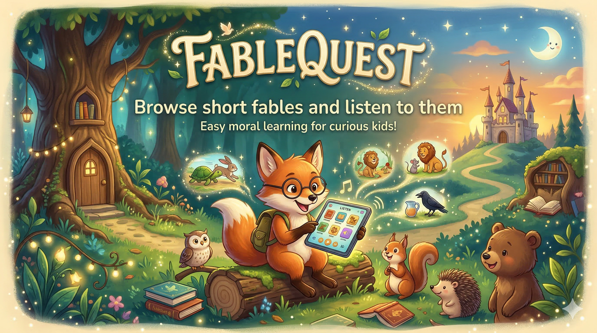

# FableQuest

Browse short fables and listen to them using ElevenLabs TTS. The browser calls a small Express proxy (`/api/tts`) so ElevenLabs credentials stay server-side.

## Run Locally

1. Install deps: `npm install`
2. Create `.env` from `.env.example`
3. Start the TTS server: `npm run dev:api`
4. Start the web app: `npm run dev`
